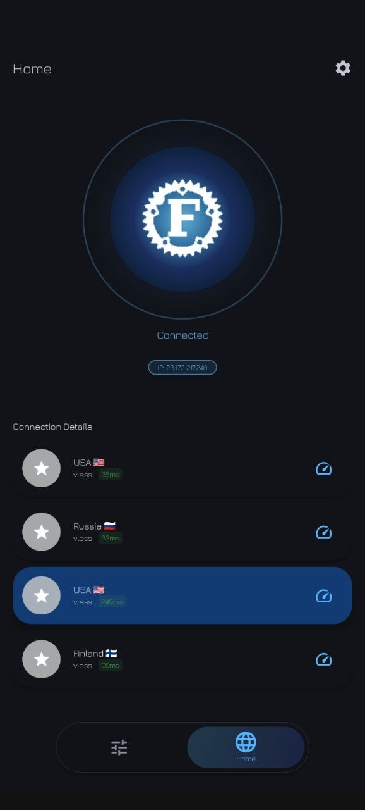
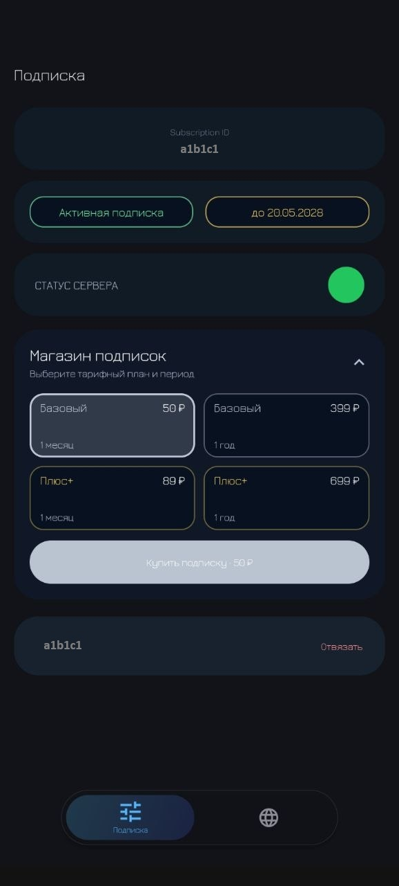

# XFreeway Client

Android client for the XFreeway network.

## Overview

XFreeway Client is a mobile Android application for connecting to XFreeway Basic and Plus subscriptions. It is adapted for the XFreeway infrastructure: direct exit nodes, cascade routes, a built-in subscription store, and short subscription links from the Mini App.

The app is based on XrayFA and uses Xray-core under the hood.

## Screenshots

  
  

## Features

- Support for XFreeway Basic and Plus subscriptions.
- Available locations display.
- Direct connections.
- Cascade routes for Plus subscriptions.
- Built-in XFreeway subscription store.
- API service status check.
- Clean connection screen with active node and IP display.
- Material Design interface, dark theme, and subscription import from the Mini App.

## Download

APK builds are published on the GitHub Releases page:

https://github.com/nulnul0ne/XFreeway-client/releases

## Version

Current release: `1.1.1`

## Attribution

XFreeway Client is based on XrayFA by Q7DF1:

https://github.com/Q7DF1/XrayFA

Original project and this derivative work are distributed under the Apache License 2.0.

## Acknowledgements

- [XrayFA](https://github.com/Q7DF1/XrayFA)
- [Xray-core](https://github.com/XTLS/Xray-core)
- [AndroidLibXrayLite](https://github.com/2dust/AndroidLibXrayLite)
- [hev-socks5-tunnel](https://github.com/heiher/hev-socks5-tunnel)

## License

Distributed under the Apache License 2.0. See [LICENSE](LICENSE) for details.
